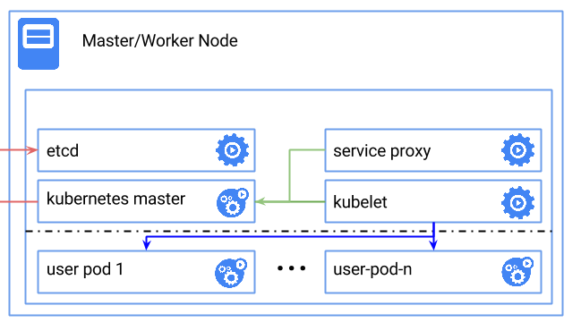

Kubernetes Solo cluster for OS X
============================



Zero to Kubernetes development environment
---------------

***Kube-Solo App has a new home, it is now under https://github.com/TheNewNormal organisation***

**Kube-Solo for Mac OS X** is a Mac Status bar App which works like a wrapper around the [corectl](https://github.com/TheNewNormal/corectl) command line tool (it makes easier to control [xhyve](https://github.com/mist64/xhyve) based VMs) and bootstraps Kubernetes on a standalone [CoreOS](https://coreos.com) VM machine.

Includes [Helm](https://helm.sh) - The Kubernetes Package Manager

Kube-Solo App can be used together with [CoreOS VM App](https://github.com/TheNewNormal/coreos-osx) which allows to build Docker containers and has a private local Docker registry which is accesable from Kube-Solo App.

**New** v0.3.2 is based on [corectl](https://github.com/TheNewNormal/corectl) which brings more stablity to the App.


Download
--------
Head over to the [Releases Page](https://github.com/TheNewNormal/kube-solo-osx/releases) to grab the latest release.


How to install Kube-Solo
----------

**Requirements**
 -----------
  - **OS X 10.10.3** Yosemite or later 
  - Mac 2010 or later for this to work.
  - If you want to use this App with any other VirtualBox based VM, you need to use newest versions of VirtualBox 4.3.x or 5.0.x.


###Install:

Open downloaded `dmg` file and drag the App e.g. to your Desktop. Start the `Kube-Solo` App and `Initial setup of Kube-Solo VM` will run.


* All dependent files/folders will be put under `kube-solo` folder in the user's home folder e.g /Users/someuser/kube-solo.
* User's Mac password will be stored in `OS X Keychain`, it will be used to pass to `sudo` command which needs to be used starting the VM, this allows to avoid using `sudo` for `corectl` to start a VM. 
* ISO images are stored under `~/.coreos/images`. That allows to share the same images between different `corectl` based Apps
* user-data file will have fleet and etcd enabled
* Will download latest CoreOS ISO image and run `corectl` to initialise VM 
* When you first time do install or 'Up' after destroying Kube-Solo setup, k8s binary files (with the version which was available when the App was built) get copied to CoreOS VM, this speeds up Kubernetes setup. To update Kubernetes just run from menu 'Updates' - Update Kubernetes to latest stable version.
* It will install `fleetctl, etcdctl and kubectl` to `~/kube-solo/bin/`
* Kubernetes services will be installed with fleet units which are placed in `~/kube-solo/fleet`, this allows very easy updates to fleet units if needed.
* [Fleet-UI](http://fleetui.com) via unit file will be installed to check running fleet units
* [Kubernetes UI](http://kubernetes.io/v1.1/docs/user-guide/ui.html) will be instlled as an add-on
* Also [DNS Add On](https://github.com/GoogleCloudPlatform/kubernetes/tree/master/cluster/addons/dns) will be installed
* Via assigned static IP (it will be shown in first boot and will survive VM's reboots) you can access any port on CoreOS VM
* Root persistant disk for VM will be created and mounted to `/` so data will survive VM reboots. 

How it works
------------

Just start `Kube-Solo` application and you will find a small icon of Kubernetes logo with `S` in the Status Bar.

* There you can `Up`, `Halt`, `Reload` CoreOS VM + Kubernetes Cluster
* `SSH to k8solo-01` will open VM shell
* Under `Up` OS Shell will be opened when VM boot finishes up and it will have such environment pre-set:

````
1) kubernetes master - export KUBERNETES_MASTER=http://192.168.64.xxx:8080
2) etcd endpoint - export ETCDCTL_PEERS=http://192.168.64.xxx:2379
3) fleetctl endpoint - export FLEETCTL_ENDPOINT=http://192.168.64.xxx:2379
4) fleetctl driver - export FLEETCTL_DRIVER=etcd
5) Path to ~/kube-solo/bin where etcdctl, fleetctl and kubernetes binaries are stored
````

* [Fleet-UI](http://fleetui.com) dashboard will show running fleet units and etc
* [Kubernetes-UI](https://github.com/GoogleCloudPlatform/kubernetes/tree/master/www) (contributed by [Kismatic.io](http://kismatic.io/)) will show nice Kubernetes Dashboard, where you can check Nodes, Pods, Replication and Service Controllers and etc.
* `k8solo-01 cAdvisor` will open cAdvisor URL in default browser
* `Updates/Update Kubernetes to the latest version` will update to latest version of Kubernetes.
* `Updates/Change Kubernetes version` will download and install specified Kubernetes version from GitHub.
* `Updates/Update OS X fleetctl and helm clients` will update fleetctl to the same versions as CoreOS VM runs and helm to the latest version.
* `Updates/Fetch latest CoreOS ISO` will download latest ISO file of CoreOS VM.

Example ouput of succesfull CoreOS + Kubernetes Solo install:

````
etcd cluster:192.168.64.2
/coreos.com
/registry

fleetctl list-machines:
MACHINE		IP		METADATA
c576b883...	192.168.64.2	role=kube

fleetctl list-units:
UNIT									MACHINE				ACTIVE	SUB
fleet-ui.service				c576b883.../192.168.64.2	active	running
kube-apiserver.service			c576b883.../192.168.64.2	active	running
kube-controller-manager.service	c576b883.../192.168.64.2	active	running
kube-kubelet.service			c576b883.../192.168.64.2	active	running
kube-proxy.service				c576b883.../192.168.64.2	active	running
kube-scheduler.service			c576b883.../192.168.64.2	active	running

kubectl get nodes:
NAME           LABELS         STATUS
192.168.64.2   node=worker1   Ready

````


Usage
------------

You're now ready to use Kubernetes cluster.

Some examples to start with [Kubernetes examples](https://github.com/GoogleCloudPlatform/kubernetes/blob/master/examples/).

Other links
-----------
* Cluster one with Kubernetes CoreOS VM App can be found here [CoreOS Kubernetes Cluster for OS X](https://github.com/rimusz/coreos-osx-kubernetes-cluster).

* Standalone CoreOS VM version App can be found here [CoreOS OS X](https://github.com/TheNewNormal/coreos-osx).

* CoreOS Cluster one App can be found here [CoreOS-Vagrant Cluster](https://github.com/rimusz/coreos-osx-cluster).
